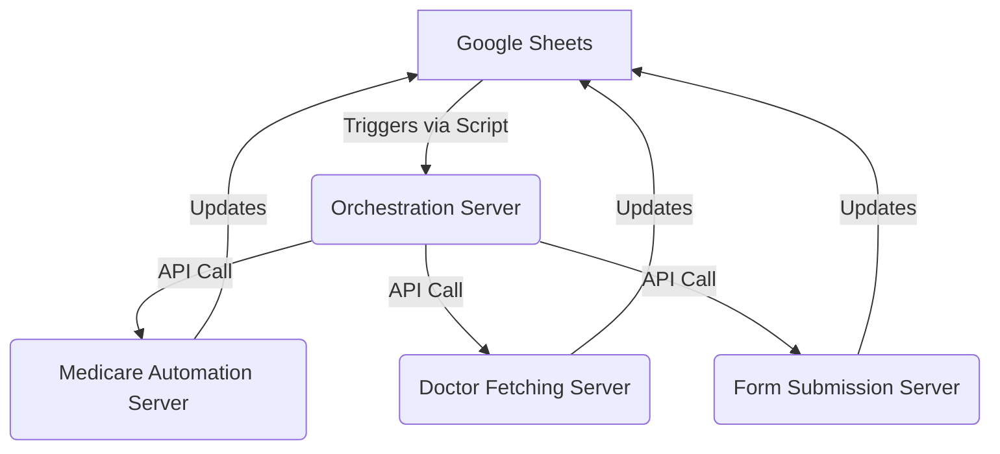

# Two-Server Medicare Automation System

This system has been separated into two distinct servers for better organization and reliability:

1. **Medicare Automation Server** - Handles account creation and doctor fetching
2. **Form Submission Server** - Handles form submissions after Medicare automation is complete

## Architecture Overview
# ChasingProject - ICO ENGINE
**Comprehensive Documentation**

---

## Table of Contents

1. [Project Overview](#project-overview)
2. [Architecture Diagram](#architecture-diagram)
3. [Component Breakdown](#component-breakdown)
    - Orchestration Server
    - Medicare Automation Server
    - Doctor Fetching Server
    - Form Submission Server
    - Google Sheets Integration
4. [Environment Setup](#environment-setup)
    - Prerequisites
    - Directory Structure
    - Environment Variables
5. [How to Run](#how-to-run)
6. [Google Sheets Configuration](#google-sheets-configuration)
7. [Server Endpoints](#server-endpoints)
8. [Port Management](#port-management)
9. [Common Workflows](#common-workflows)
10. [Troubleshooting](#troubleshooting)
11. [Security Notes](#security-notes)
12. [Extending the System](#extending-the-system)
13. [FAQ](#faq)

---

## 1. Project Overview

This project automates the process of Medicare account creation, doctor validation, and form submission, orchestrated via a central gateway and integrated with Google Sheets for data input/output. It is designed for high concurrency, robust error handling, and modular extensibility.

---

## 2. Architecture Diagram



---

## 3. Component Breakdown

### Orchestration Server (`orchestration-server.js`)
- **Role:** Central gateway, manages workflow, proxies requests to other servers.
- **Endpoints:** `/health`, `/queue/add-lead`, `/queue/status`, `/medicare-proxy/*`, `/doctor-proxy/*`, `/form-proxy/*`
- **Config:** Reads server URLs and port from `.env`.

### Medicare Automation Server (`MedicareAutomation/medicare-server.js`)
- **Role:** Automates Medicare account creation, interacts with Google Sheets.
- **Endpoints:** `/health`, `/process-medicare`, `/queue-status`, `/account-status`
- **Config:** Reads port and Google credentials from `.env`.

### Doctor Fetching Server (`MedicareAutomation/doctor-fetching-server.js`)
- **Role:** Automates doctor validation and fetching, updates Google Sheets.
- **Endpoints:** `/health`, `/fetch-doctors`, `/test-init`, `/test-login`
- **Config:** Reads port from `.env`.

### Form Submission Server (`FormSubmission/form-server.py`)
- **Role:** Submits forms to Google Forms, handles queueing and retries.
- **Endpoints:** `/health`, `/submit-form`, `/submit`, `/submit-cgm`, `/queue-status`
- **Config:** Reads port from `.env`.

### Google Sheets Integration
- **Role:** Central data source and sink for all automation.
- **Sheets:** Patient data, doctor results, automation status, etc.
- **Scripts:** Google Apps Script for triggers and data flow.

---

## 4. Environment Setup

### Prerequisites
- **Node.js** (v16+ recommended)
- **Python** (for FormSubmission server)
- **npm** (Node package manager)
- **pip** (Python package manager)
- **Google Cloud Project** with Sheets API enabled
- **Google OAuth Credentials** (client ID, secret, refresh token)

### Directory Structure
```
ChasingProject - ICO ENGINE/
  ChasingSubmission-main/
    orchestration-server.js
    MedicareAutomation/
      medicare-server.js
      doctor-fetching-server.js
      google-sheets-service.js
      .env
      env.example
    FormSubmission/
      form-server.py
      .env
    .env
    env-template.txt
```

### Environment Variables

#### Project Root `.env`
```
ORCHESTRATION_PORT=7000
MEDICARE_SERVER_URL=http://localhost:6001
DOCTOR_SERVER_URL=http://localhost:6002
FORM_SERVER_URL=http://localhost:6003
```

#### `MedicareAutomation/.env`
```
GOOGLE_CLIENT_ID=...
GOOGLE_CLIENT_SECRET=...
GOOGLE_REFRESH_TOKEN=...
GOOGLE_SHEET_ID=...
GOOGLE_SHEET_RANGE=...
HEADLESS=false
SLOW_MO=0
MEDICARE_PORT=6001
DOCTOR_PORT=6002
FORM_SERVER_PORT=6003
```

#### `FormSubmission/.env`
```
FORM_SERVER_PORT=6003
```

---

## 5. How to Run

### 1. **Install Dependencies**
- Node servers:
  ```sh
  cd ChasingSubmission-main/MedicareAutomation
  npm install
  cd ..
  npm install
  ```
- Python server:
  ```sh
  cd ChasingSubmission-main/FormSubmission
  pip install -r requirements.txt
  ```

### 2. **Start Servers**
- **Medicare Server:**  
  `cd MedicareAutomation && node medicare-server.js`
- **Doctor Fetching Server:**  
  `cd MedicareAutomation && node doctor-fetching-server.js`
- **Form Submission Server:**  
  `cd FormSubmission && python form-server.py`
- **Orchestration Server:**  
  `cd .. && node orchestration-server.js`

### 3. **(Optional) Use Batch Scripts**
- `start-all-servers.bat` to launch all at once.

---

## 6. Google Sheets Configuration

- **Sheet Link:**  
  `https://docs.google.com/spreadsheets/d/1kx897RqWGOkrGd4Gu920l6lPEmglQTcZhPUcGsO8x1U/edit`
- **Sheet Names:**  
  `INCALL_1_RESPONSE`, `INCALL_2_RESPONSE`
- **Columns:**  
  - Q: Last Name
  - S: Med ID
  - T: DOB
  - X: State
  - Y: Address
  - AG: Part A Eligibility
  - AH: Part B Eligibility
  - BW: Credentials

- **Extraction Logic:**  
  - **Zip Code:** From column Y (address), else extract from address string.
  - **State:** From column X, else extract from address string.

---

## 7. Server Endpoints

### Orchestration Server
- `GET /health`
- `GET /queue/status`
- `POST /queue/add-lead`
- `GET /medicare-proxy/*`
- `GET /doctor-proxy/*`
- `GET /form-proxy/*`

### Medicare Server
- `GET /health`
- `POST /process-medicare`
- `GET /queue-status`
- `GET /account-status`

### Doctor Fetching Server
- `GET /health`
- `POST /fetch-doctors`
- `POST /test-init`
- `POST /test-login`

### Form Submission Server
- `GET /health`
- `POST /submit-form`
- `POST /submit`
- `POST /submit-cgm`
- `GET /queue-status`

---

## 8. Port Management

| Server           | Default Port | Env Variable             | .env Location                |
|------------------|--------------|--------------------------|------------------------------|
| Orchestration    | 7000         | ORCHESTRATION_PORT       | Project root                 |
| Medicare         | 6001         | MEDICARE_PORT            | MedicareAutomation/.env      |
| Doctor Fetching  | 6002         | DOCTOR_PORT              | MedicareAutomation/.env      |
| Form Submission  | 6003         | FORM_SERVER_PORT         | FormSubmission/.env          |

**Note:**  
- Chrome and some browsers block "unsafe" ports (e.g., 6000). Use 7000+ for orchestration.

---

## 9. Common Workflows

### **A. New Patient Automation**
1. User edits Google Sheet.
2. Google Apps Script triggers orchestration server via ngrok/public URL.
3. Orchestration server adds lead to queue.
4. Medicare server processes account creation.
5. Doctor fetching server validates and fetches doctors.
6. Form submission server submits results.
7. All results/statuses are written back to Google Sheets.

### **B. Manual Trigger**
- You can POST to `/queue/add-lead` on the orchestration server to manually add a lead.

---

## 10. Troubleshooting

### **Port Already in Use**
- Error: `EADDRINUSE`
  - Solution: Kill the process using the port (`netstat -ano | findstr :PORT`, then `taskkill /PID <pid> /F`).

### **.env Not Loaded**
- Ensure `.env` files exist and are in the correct directory.
- No spaces around `=` in variable assignments.

### **Chrome Blocks Port**
- Use ports above 1024 and avoid browser-blocked ports (e.g., 6000).

### **Cannot GET /**
- The root path `/` is not defined. Use `/health` or other documented endpoints.

### **Orchestration Calls Wrong Port**
- Ensure orchestration server uses `process.env.MEDICARE_SERVER_URL` and `.env` is set.

---

## 11. Security Notes

- **Do not commit `.env` files** with real credentials to version control.
- **Google credentials** should be kept secret.
- **ngrok/public URLs** should be rotated if leaked.
- **Validate all incoming data** to prevent injection attacks.

---

## 12. Extending the System

- **Add new endpoints** by editing the relevant server file.
- **Add new Google Sheet columns** and update extraction logic in `google-sheets-service.js`.
- **Integrate new automation steps** by adding to the orchestration server workflow.

---

## 13. FAQ

**Q: How do I change the Google Sheet?**  
A: Update the `GOOGLE_SHEET_ID` in your `.env` and restart the servers.

**Q: How do I add a new server?**  
A: Add the server, expose its port, and update the orchestration server and `.env` accordingly.

**Q: How do I debug a failing automation?**  
A: Check logs for each server, verify `.env` files, and use `/health` endpoints.

**Q: How do I reset everything?**  
A: Stop all servers, kill any lingering processes, clear `.env` files if needed, and restart.

---

## **End of Documentation**

If you need a PDF, markdown, or a more detailed breakdown of any section, let me know! 
```
Google Sheets → Medicare Automation Server → Form Submission Server
```

### Flow:
1. When conditions are met in Google Sheets (Status and Quality Check), Medicare Automation Server is triggered first
2. Medicare Server creates accounts, fetches doctors, and saves results to the sheet
3. After Medicare automation is complete, Form Submission Server is triggered to submit the form
4. Final submission status is updated in the sheet

## Setup Instructions

### 1. Medicare Automation Server

Navigate to the MedicareAutomation directory:
```bash
cd MedicareAutomation
npm install
```

Start the Medicare Automation Server:
```bash
npm run server
# or
node medicare-server.js
```

The server will run on port 3001 by default.

### 2. Form Submission Server

Navigate to the FormSubmission directory:
```bash
cd FormSubmission
pip install -r requirements.txt
```

Start the Form Submission Server:
```bash
python form-server.py
```

The server will run on port 5000 by default.

### 3. Google Sheets Configuration

Update the Google Script with your server URLs:

```javascript
// 🌐 SERVER URLs - UPDATE THESE WITH YOUR ACTUAL SERVER URLs
var medicareServerUrl = "http://localhost:3001"; // Medicare Automation Server
var formServerUrl = "http://localhost:5000";     // Form Submission Server
```

If using ngrok or other tunneling services, update these URLs accordingly.

## Server Details

### Medicare Automation Server (Port 3001)

**Endpoints:**
- `GET /health` - Health check
- `POST /process-medicare` - Process Medicare automation for a patient
- `GET /queue-status` - Get current queue status

**Features:**
- Queue-based processing
- Account creation automation
- Doctor fetching automation
- Direct sheet updates
- Error handling and status reporting

### Form Submission Server (Port 5000)

**Endpoints:**
- `GET /health` - Health check
- `POST /submit-form` - Submit form data (new endpoint)
- `POST /submit` - Legacy braces form endpoint
- `POST /submit-cgm` - Legacy CGM form endpoint

**Features:**
- Supports both braces and CGM forms
- JSON-based form submission
- Backward compatibility with legacy endpoints

## Usage

### Starting Both Servers

1. **Terminal 1 - Medicare Server:**
```bash
cd MedicareAutomation
npm run server
```

2. **Terminal 2 - Form Server:**
```bash
cd FormSubmission
python form-server.py
```

### Testing the System

1. **Test Medicare Server:**
```bash
curl http://localhost:3001/health
```

2. **Test Form Server:**
```bash
curl http://localhost:5000/health
```

### Google Sheets Integration

The system automatically triggers when:
- Status column contains valid values (VERIFIED DR CHASE, etc.)
- Quality Check column contains "PASSED"
- Lead Status is not already "Submitted"

## Environment Variables

### Medicare Automation Server
Create a `.env` file in the MedicareAutomation directory:
```
MEDICARE_PORT=3001
GOOGLE_SHEET_ID=your_sheet_id
HEADLESS=false
SLOW_MO=1000
```

### Form Submission Server
Create a `.env` file in the FormSubmission directory:
```
FORM_SERVER_PORT=5000
```

## Monitoring and Logs

Both servers provide detailed console logging:
- 🏥 Medicare automation progress
- 📋 Queue status updates
- 📝 Form submission results
- ❌ Error messages and debugging info

## Troubleshooting

### Common Issues:

1. **Medicare Server Not Starting:**
   - Check if Chrome is installed
   - Verify Google Sheets credentials
   - Ensure port 3001 is available

2. **Form Server Not Starting:**
   - Verify Python dependencies installed
   - Check if port 5000 is available
   - Ensure Flask is properly installed

3. **Google Sheets Connection Issues:**
   - Verify Google credentials
   - Check sheet permissions
   - Ensure correct sheet ID in environment variables

### Debug Mode:

Enable debug mode by setting environment variables:
```bash
# Medicare Server
HEADLESS=false
SLOW_MO=2000

# Form Server
FLASK_DEBUG=true
```

## Benefits of Separation

1. **Better Resource Management** - Each server handles its specific tasks
2. **Improved Reliability** - If one server fails, the other continues working
3. **Easier Debugging** - Isolated logs and error handling
4. **Scalability** - Servers can be scaled independently
5. **Maintenance** - Updates can be deployed to individual servers

## Testing

### Create Test Files

You can create test files to verify functionality:

```bash
# Test Medicare server
node test-medicare-server.js

# Test Form server
python test-form-server.py
```

**Note:** Test files will be automatically created and removed after testing as requested. 


